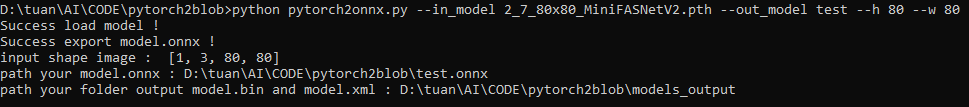
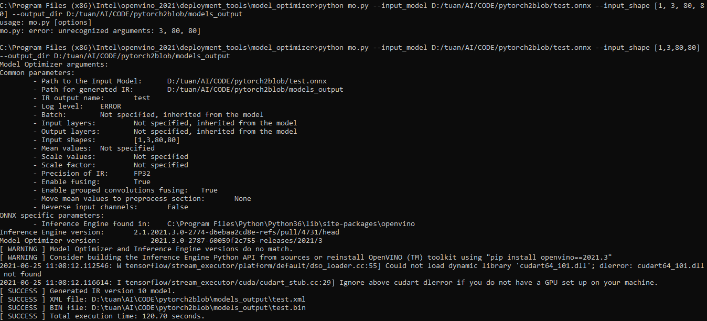

# CONVERT YOUR MODEL TO IR FORMAT

## PYTORCH2ONNX

- Run file `pytorch2onnx.py` on command :

  ```python
  python pytorch2onnx.py --in_model 2_7_80x80_MiniFASNetV2.pth --out_model test
  ```

- Output : 

## ONNX2IR

Copy `path your model.onnx`, `input shape image` and `path your folder output model.bin and model.xml` from output of `pytorch2onnx.py`

- Complete installation openvinotoolkit, Cd ../openvino_2021/deployment_tools/model_optimizer and run :

  ```python    
  python mo.py --input_model <path your model.onnx> --input_shape [input shape image] --output_dir <path your folder output model.bin and model.xml>
  ```

- Output : 

## IR2BLOB

Using online converter : [Link](http://luxonis.com:8080/)

- Choose openvino version (default 2021.3 version), next step choose OpenVino Model then upload Model.bin and Model.xml

- Output : 

Or install package blobconverter : [Link](https://pypi.org/project/blobconverter/)

- Copy path of `XML file` and `BIN file` from output of `mo.py` 

- Then, run `onnx2blob.py` on command

  ```python    
  python onnx2blob.py --xml_model <XML file> --bin_model <BIN file>
  ```
- Output : 

Path saves your blob model `C:\Users\Tuan\.cache\blobconverter\test_openvino_2021.3_4shave.blob...`

## Documentation

[Documentation](https://linktodocumentation)

